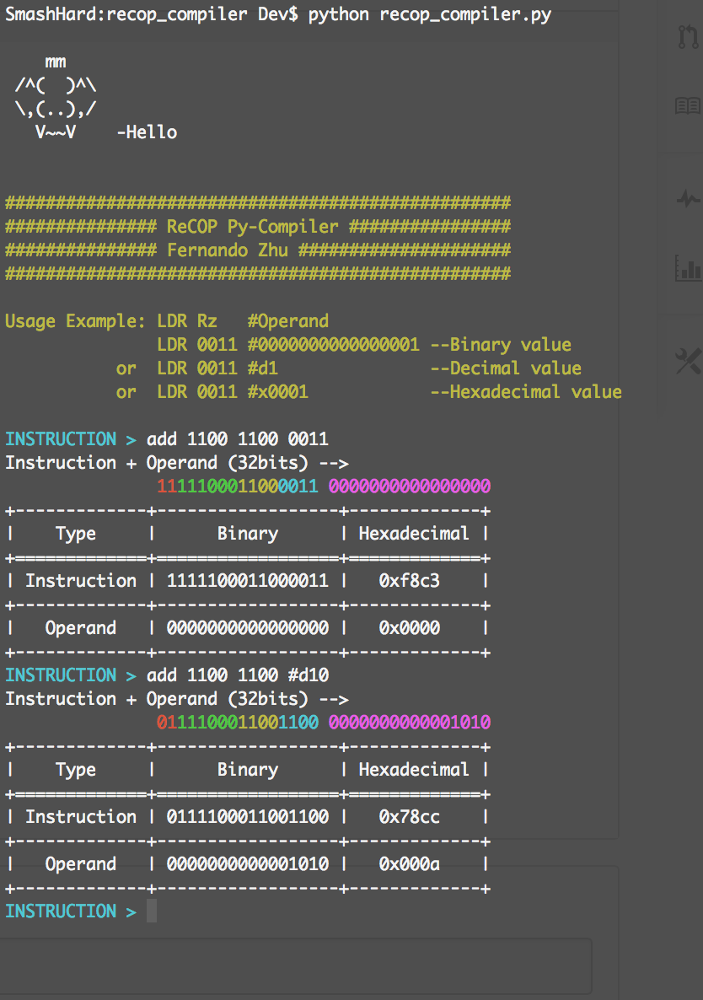

# ReCOP Python Compiler
A small python program converts ReCOP Processor assembly instruction to 32-bit machine code.
It converts a total number of 33 instructions including AND, OR, ADD, JUMP, DCALLBL and so on.

# Usage
A screen short of the running program is shown below.
<ul>
  <li>Run the program using python interpreter: python recop_compiler</li>
  <li>Type in ReCOP assembly instruction</li>
  <li>When operand contains binary value, follow format: '0000000000000001'</li>
  <li>When operand contains decimal value, follow format: 'd1'</li>
  <li>When operand contains hexadecimal value, follow format: 'x0001'</li>
  <li>Add '#' to the front of the operand when the operand is an immediate value</li>
  <li>Add '$' to the front of the operand when the operand is an address</li>
  <li>When finish using the program, type in 'q' or 'quit' and press Enter to exit.</li>
</ul>
# Examples  
    // AND Rz Rz Rx
    and 1000 1000 1100
    // ADD Rz Rx #Operand
    add 1100 1000 #0000000000001010
    add 1100 1000 #d10
    add 1100 1000 #x000a
    // JUMP #Operand 
    jump #xbeef
    // LDR Rz $Operand
    ldr 0011 $0000000001100100
    ldr 0011 $d100
    ldr 0011 $x0064
    

# Note
<ul>
  <li>As shown above, the instruction is color coded, from left to right, addressing mode, opcode, rz, rx and operand are distinguished by different colors.</li>
  <li>The operand input can be binary, decimal or hexadecimal numbers. However the register number of rx and rz should always be binary.</li>
  <li>Due to the limitation of windows cmd prompt, this program won't be able to display multiple colors under windows environment, instead, it instead spreads out different code segments to increase readability. For example the last color coded machine code shown above will become 01 111000 1100 1100 0000000000001010</li>
</ul>
